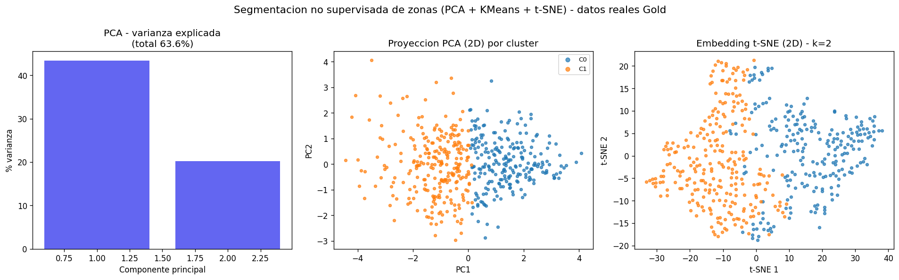

# Secciones para el informe — Entrega 6 (TF)

> **Cómo usar este archivo:** las secciones de abajo están redactadas en el estilo y numeración
> de tu informe (que terminaba en la sección 29 – Referencias). Pega las secciones 30 y 31 **antes**
> de "29. Referencias bibliográficas" (o renumera según convenga). La figura referenciada es
> `docs/refs/segmentation_pca_tsne.png`. El resumen ejecutivo completo está en
> `docs/resumen-ejecutivo.md` (documento aparte, entregable independiente).

---

## 30. Segmentación no supervisada — PCA, KMeans y t-SNE

La segmentación de la sección 19 era **por reglas** (flags `es_capital`, `es_summerhouse`,
`periodo_macro`, terciles de tamaño). Para la Entrega 6 se añade una técnica **no supervisada** que
descubre estructura en los datos sin imponer etiquetas a priori, respondiendo a la pregunta:
*¿se agrupan los códigos postales daneses en perfiles de riesgo-retorno homogéneos, y esos grupos
coinciden con la división Capital vs. Provincias de H2?* El método **no recibe la región como
input**; si reconstruye una división geográfica, es una confirmación emergente (no circular) de H2.

**Espacio de features (por `zip_code`).** Se parte del mart Gold real `mart_transactions_map`
(24 124 filas `year × zip_code`) y se colapsa cada código postal a 6 variables interpretables:

| Feature | Definición | Interpretación |
|---|---|---|
| `price_level` | mediana de precio real/m² en la ventana reciente (5 años) | nivel de precio |
| `cagr_real` | crecimiento anual compuesto del precio real | retorno histórico |
| `volatility` | desvío estándar del cambio interanual | riesgo de fluctuación |
| `max_drawdown` | peor caída pico-valle (%) | riesgo de cola |
| `liquidity_log` | log(1 + volumen medio de transacciones/año) | liquidez |
| `growth_recent` | crecimiento del precio en los últimos 5 años | momentum |

Se filtran zips con <10 años de historia o <15 transacciones/año y se winsorizan las features a
`[p1, p99]` para robustez ante outliers. Sobreviven **483 de 932 zips**. Las features se
estandarizan (`StandardScaler`).

**Reducción de dimensionalidad (PCA).** Dos componentes retienen el **63.6 %** de la varianza
(PC1 = 43.4 %, PC2 = 20.2 %). PC1 es el eje dominante riesgo-retorno.

**Selección de k y clustering (KMeans).** Se evalúa `k ∈ {2..8}` por coeficiente de silueta; el
máximo está en **k = 2** (silueta 0.265). El clustering se hace sobre las 6 features estandarizadas.

**Validación no lineal (t-SNE).** Un embedding t-SNE 2D (perplejidad 30) separa los mismos dos
grupos, confirmando que la estructura no es un artefacto de la métrica euclídea (ver figura).



**Resultado — dos perfiles de mercado:**

| Cluster | Etiqueta | n zips | Región dominante | Precio real/m² | CAGR | Volatilidad | Drawdown medio |
|---|---|---:|---|---:|---:|---:|---:|
| 0 | Precio alto / dinámico / estable | 229 | Zealand (51 %) | 24 848 | +2.5 %/año | 0.19 | −41.9 % |
| 1 | Precio bajo / plano / volátil | 254 | Jutland (Provincias) | 12 979 | +1.1 %/año | 0.42 | −62.0 % |

El cluster de precio alto concentra el metro de Copenhague (Nordhavn, København V, Klampenborg,
Hellerup); el de precio bajo duplica la volatilidad y sufre drawdowns 20 pp más profundos.

**Integración al análisis.** (i) *Confirma H2 de forma emergente*: sin usar la región, el clustering
reconstruye la división resiliencia-capital vs. fragilidad-provincia. (ii) *Refina H3*: el riesgo no
es solo por tipología sino **geográfico** — las provincias de bajo ticket combinan menor retorno con
peor drawdown. (iii) *Alimenta el dashboard*: `mart_zip_segments.csv` añade `cluster_label` por zip,
listo para colorear el mapa coroplético por perfil de riesgo, y `mart_segment_profiles.csv` da la
tabla de centroides.

**Reproducibilidad.** `uv run python scripts/run_segmentation.py --config configs/analysis.yaml`
(determinista, `random_state=42`; parámetros en `configs/analysis.yaml → segmentation`). Metodología
completa en `docs/segmentation-pca-clustering-methodology.md`.

**Limitaciones.** Segmentación descriptiva (no predice ni implica causalidad); la silueta (0.27)
indica estructura moderada — el mercado es un continuo riesgo-retorno con dos modos, no dos
poblaciones disjuntas; 449 zips de baja cobertura quedan fuera por diseño.

---

## 31. QA técnico y reproducibilidad

El aseguramiento de calidad se automatiza en `scripts/run_qa.py`, que en una corrida verifica
integridad de datos y **reconcilia las cifras del informe/dashboard con los marts** (última corrida:
**23/23 chequeos OK**). Extracto:

| Cifra publicada | Fuente | Verificación |
|---|---|---|
| Peor drawdown −92.1 % (Bornholm/Apartment/2018Q3) | `mart_drawdowns` | ✅ −92.11 % |
| Índice Zealand 2024Q4 ≈ 210 (>2× base 1992) | `mart_quarterly_regional_index` | ✅ 210.3 |
| Fyn & islands < 100 (bajo su nivel 1992) | `mart_quarterly_regional_index` | ✅ 90.8 |
| Campeón XGBoost R²=0.44, MAE≈867k DKK | `mart_model_comparison` | ✅ |
| Ranking riesgo Apartment→Villa; segmentación 2 clusters | `mart_drawdowns`, `mart_segment_profiles` | ✅ |

Reproducibilidad: parámetros centralizados en `configs/analysis.yaml` (sin números mágicos),
determinismo con `random_state=42`, entorno congelado en `uv.lock`, 13 tests unitarios de limpieza
(`uv run pytest tests/`) y quality gate `run_qa.py`. Detalle en `docs/qa-tecnico.md`.

```bash
uv run python scripts/export_marts.py --config configs/analysis.yaml       # marts KPIs
uv run python scripts/run_segmentation.py --config configs/analysis.yaml   # PCA/KMeans/t-SNE
uv run python scripts/run_qa.py                                            # QA 23/23
uv run pytest tests/ -q                                                    # tests
```
